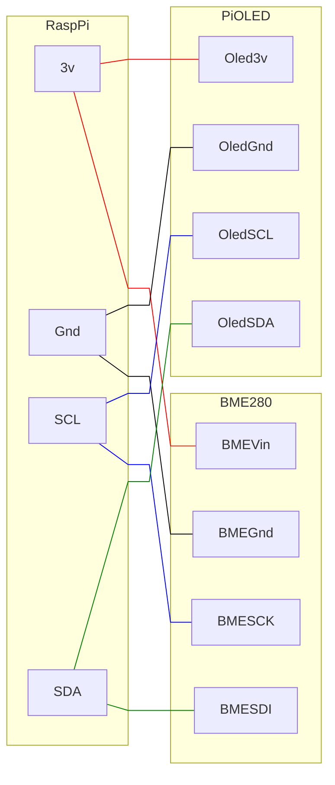

```mermaid
flowchart LR
    subgraph RaspPi
        3v;Gnd;SCL;SDA
    end
    subgraph PiOLED
        Oled3v;OledSCL;OledSDA;OledGnd
    end
    subgraph BME280
        BMEVin;BMEGnd;BMESCK;BMESDI
    end

    3v --- Oled3v & BMEVin
    Gnd --- OledGnd & BMEGnd
    SCL --- OledSCL & BMESCK
    SDA --- OledSDA & BMESDI

    linkStyle default interpolate linear;
    linkStyle 0,1 stroke:red;
    linkStyle 2,3 stroke:black;
    linkStyle 4,5 stroke:blue;
    linkStyle 6,7 stroke:green;
```
