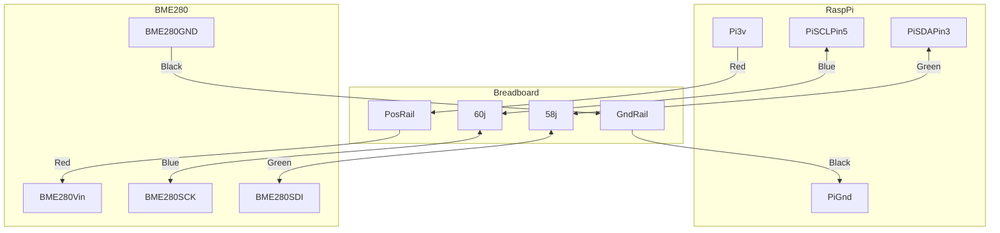

```mermaid
flowchart TB;
    subgraph RaspPi
    Pi3v
    PiGnd
    PiSCLPin5
    PiSDAPin3
    end
    subgraph Breadboard
    PosRail
    GndRail
    60j
    58j
    end
    subgraph BME280
    BME280Vin
    BME280GND
    BME280SCK
    BME280SDI
    end
    Pi3v--Red-->PosRail;
    PosRail--Red-->BME280Vin;
    BME280GND--Black-->GndRail;
    GndRail--Black-->PiGnd; 
    60j <--Blue--> BME280SCK;
    PiSCLPin5 <--Blue--> 60j;
    PiSDAPin3 <--Green--> 58j;
    58j <--Green--> BME280SDI;
```
